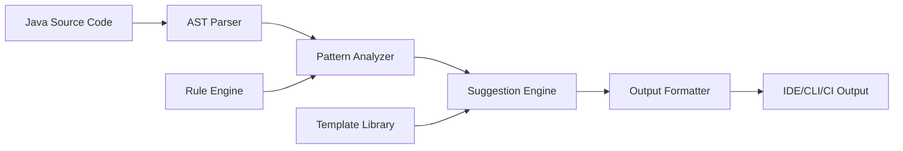

# Design Document

## Overview

The Java Code Quality system will be implemented as a static analysis tool that identifies null-handling anti-patterns and suggests modern Optional-based refactorings. The system will use Abstract Syntax Tree (AST) parsing to analyze Java source code, pattern matching to identify refactoring opportunities, and a suggestion engine to provide contextual improvements with explanations.

The tool will integrate into development workflows through IDE plugins, CLI tools, or CI/CD pipeline integration, providing real-time feedback to developers about code quality improvements.

## Architecture

The system follows a pipeline architecture with four main stages:

1. **Parser Stage**: Converts Java source code into AST representations
2. **Analysis Stage**: Identifies patterns and anti-patterns in the AST
3. **Suggestion Stage**: Generates refactoring suggestions with explanations
4. **Output Stage**: Formats and presents suggestions to developers



## Components and Interfaces

### AST Parser Component
- **Purpose**: Parse Java source files into traversable AST structures
- **Technology**: JavaParser library or Eclipse JDT Core
- **Interface**: 
  ```java
  public interface ASTParser {
      CompilationUnit parse(String sourceCode);
      List<CompilationUnit> parseDirectory(Path directory);
  }
  ```

### Pattern Analyzer Component
- **Purpose**: Traverse AST and identify null-handling patterns
- **Key Patterns Detected**:
  - Ternary null checks: `value == null ? default : transform(value)`
  - If-else null blocks: `if (value == null) { ... } else { ... }`
  - Repeated method calls in null checks
  - Unsafe method chaining
- **Interface**:
  ```java
  public interface PatternAnalyzer {
      List<PatternMatch> analyzeCompilationUnit(CompilationUnit unit);
  }
  ```

### Suggestion Engine Component
- **Purpose**: Generate Optional-based refactoring suggestions
- **Capabilities**:
  - Template-based code generation
  - Context-aware explanations
  - Safety validation (performance warnings, anti-pattern detection)
- **Interface**:
  ```java
  public interface SuggestionEngine {
      List<Suggestion> generateSuggestions(List<PatternMatch> patterns);
  }
  ```

### Rule Engine Component
- **Purpose**: Configurable rules for pattern detection and suggestion generation
- **Features**:
  - Severity levels (error, warning, info)
  - Customizable rule sets
  - Performance-sensitive code detection
- **Interface**:
  ```java
  public interface RuleEngine {
      List<Rule> getActiveRules();
      boolean shouldApplyRule(Rule rule, ASTNode context);
  }
  ```

## Data Models

### PatternMatch Model
```java
public class PatternMatch {
    private PatternType type;
    private ASTNode node;
    private SourceLocation location;
    private String originalCode;
    private Map<String, Object> context;
    private SeverityLevel severity;
}
```

### Suggestion Model
```java
public class Suggestion {
    private String id;
    private PatternMatch sourcePattern;
    private String suggestedCode;
    private String explanation;
    private List<String> benefits;
    private List<String> warnings;
    private RefactoringType type;
}
```

### Rule Model
```java
public class Rule {
    private String id;
    private String name;
    private PatternType targetPattern;
    private Predicate<ASTNode> condition;
    private SeverityLevel defaultSeverity;
    private boolean performanceSensitive;
}
```

## Error Handling

### Parser Errors
- **Syntax Errors**: Log and skip malformed files, continue processing others
- **Encoding Issues**: Attempt multiple encodings, fallback to UTF-8
- **Large Files**: Implement streaming parsing for memory efficiency

### Analysis Errors
- **Complex Expressions**: Gracefully handle expressions too complex for pattern matching
- **Ambiguous Patterns**: Provide multiple suggestions when pattern matching is uncertain
- **Performance Degradation**: Implement timeouts and circuit breakers for analysis

### Suggestion Generation Errors
- **Template Failures**: Fallback to simpler suggestion templates
- **Context Missing**: Provide generic suggestions when specific context unavailable
- **Validation Failures**: Skip invalid suggestions rather than presenting broken code

## Testing Strategy

### Unit Testing
- **Parser Tests**: Verify AST generation for various Java constructs
- **Pattern Detection Tests**: Test each pattern type with positive/negative cases
- **Suggestion Generation Tests**: Validate generated code syntax and semantics
- **Rule Engine Tests**: Test rule evaluation logic and configuration

### Integration Testing
- **End-to-End Pipeline**: Test complete flow from source code to suggestions
- **IDE Integration**: Test plugin functionality in real development environments
- **Performance Testing**: Validate analysis speed on large codebases

### Test Data Strategy
- **Synthetic Examples**: Hand-crafted examples covering all pattern types
- **Real-World Samples**: Open-source Java projects with known null-handling patterns
- **Edge Cases**: Complex expressions, nested patterns, performance-critical code

### Validation Approach
- **Code Compilation**: Ensure all suggested refactorings compile successfully
- **Semantic Equivalence**: Verify refactored code maintains original behavior
- **Performance Impact**: Measure Optional overhead in performance-critical scenarios
- **Developer Feedback**: A/B testing of suggestion quality and usefulness